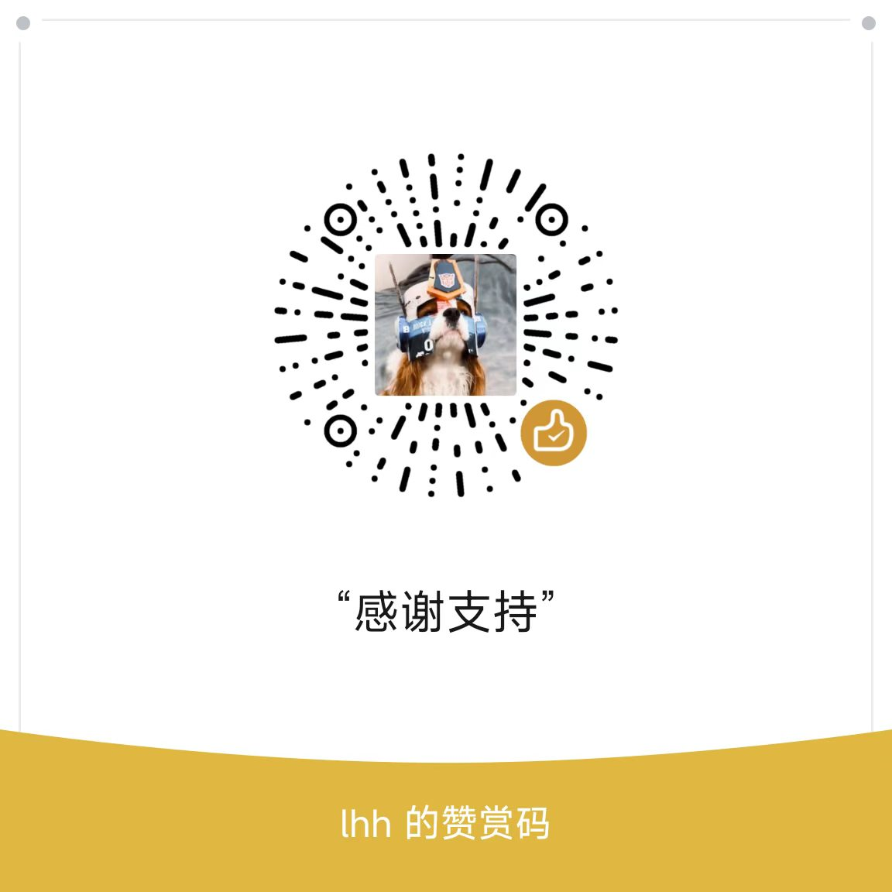

<div align="center">

  <h1>AI Proxy Manager</h1>
  <h3>将 Codex Desktop 接入第三方大模型</h3>
  <p>DeepSeek · Kimi Code · Moonshot — 无需 VPN，按量付费，比 OpenAI 便宜</p>

  <p>
    
    
    
    
    
  </p>

  <p>
    <a href="#-快速开始">快速开始</a> &bull;
    <a href="#-配置-codex">配置 Codex</a> &bull;
    <a href="#-支持的供应商">支持的供应商</a> &bull;
    <a href="#-常见问题">常见问题</a> &bull;
    <a href="#-源码启动">源码启动</a>
  </p>

  <br>

  <table>
    <tr>
      <td align="center">
        <br>
        <sub>☕ 赞赏</sub>
      </td>
      <td align="center">
        <br>
        <sub>💬 微信群</sub>
      </td>
    </tr>
  </table>

</div>

---

> **声明**：本项目是本地代理工具，不提供任何 API Key 或账号。你需要自行去第三方平台申请 Key 并充值。代理本身完全免费、开源。

---

## 🚀 快速开始

### 1. 准备

- 去 [DeepSeek](https://platform.deepseek.com) / [Kimi Code](https://www.kimi.com/code) / [Moonshot](https://platform.moonshot.cn) 申请 API Key
- 确保 **Codex Desktop** 已安装

### 2. 下载安装

下载 `AI Proxy Manager Setup 2.4.0.exe`，双击安装，打开桌面快捷方式。

**不需要装 Python**，所有依赖已打包在内。

### 3. 添加模型

打开前端界面，点击「添加模型」：

| 供应商 | 模型 ID | API 地址 |
|--------|---------|----------|
| DeepSeek | `deepseek-chat` | `https://api.deepseek.com` |
| Kimi Code | `kimi-k2.6` | `https://api.kimi.com/coding/v1` |
| Moonshot | `moonshot-v1-128k` | `https://api.moonshot.cn/v1` |

填入 Key，保存后点击「启用」。

### 4. 配置 Codex

编辑 `C:\Users\你的用户名\.codex\config.toml`，全选替换为：

```toml
model_provider = "custom"
model = "deepseek-v4-pro"

model_context_window = 1000000
model_auto_compact_token_limit = 900000

[model_providers]
[model_providers.custom]
name = "custom"
wire_api = "responses"
requires_openai_auth = false
base_url = "http://127.0.0.1:15800/v1"

[windows]
sandbox = "elevated"

[features]
memories = true

[memories]
generate_memories = true
use_memories = true

[plugins."browser-use@openai-bundled"]
enabled = true
```

> 只需改 `model` 这一行，改成你在前端启用的模型 ID。

保存，重新打开 Codex。

### 5. 验证

在 Codex 发一条消息，如果前端「日志」标签页看到请求记录，说明配置成功。

---

## 🎛️ 功能

| 功能 | 说明 |
|------|------|
| 多供应商 | DeepSeek / Kimi Code / Moonshot 一键切换 |
| 协议自动检测 | Kimi Code 自动切 Anthropic 格式，其他走 OpenAI |
| 推理开关 | 每个模型独立控制推理增强 |
| 独立配置 | 每模型独立 API 地址和 Key |
| 实时日志 | 查看每条请求的转发状态 |
| 系统托盘 | 最小化到托盘，开机自启 |

---

## ❓ 常见问题

**前端操作没反应？**
→ 确认代理已启动（界面显示"运行中"）。

**Codex 报 502 或连接错误？**
→ 确认代理正在运行中。若已运行，重启 Codex。

**Codex 启动卡住/白屏？**
→ `config.toml` 中删掉 `[windows]` 和 `sandbox = "elevated"` 那两行。

**Kimi Code 报 400 错误？**
→ 关掉该模型的推理开关。

**子代理创建失败？**
→ Codex 自身上限，跟代理无关，稍后重试。

---

## 🔧 源码启动

```bash
pip install -r requirements.txt
python proxy_manager.py
```

前端：

```bash
cd frontend
npm install
npm run electron:dev
```

---

## 📁 项目结构

```
deepseek-proxy-manager/
├── proxy_manager.py              ← 后端启动器
├── api_server.py                 ← Flask REST API
├── proxy/
│   ├── config.py                 ← 配置、缓存
│   ├── server.py                 ← HTTP 代理服务器
│   ├── handler.py                ← 路由
│   ├── translate_openai.py       ← Responses → Chat Completions
│   └── translate_anthropic.py    ← Responses → Anthropic Messages
└── frontend/
    ├── src/                      ← React + TypeScript 前端
    ├── electron/                 ← Electron 主进程
    └── package.json
```
