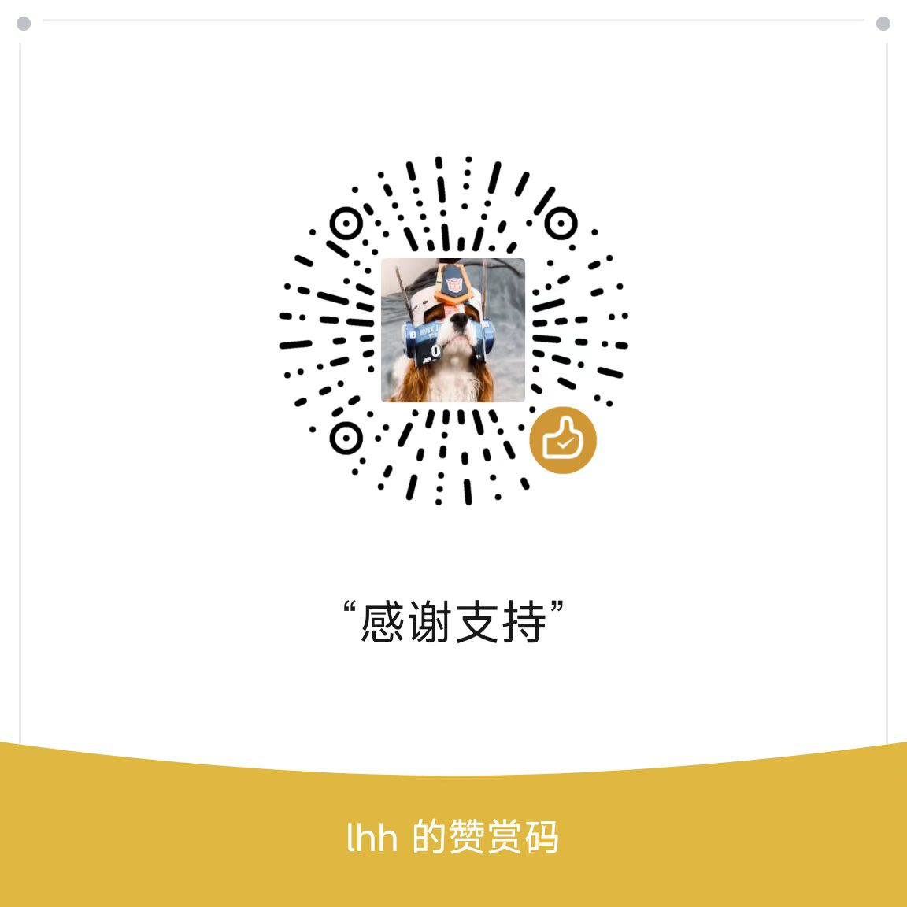

<div align="center">

# AI Proxy Manager

### Codex Desktop 的本地模型与账号控制台

把第三方 API、官方账号、插件能力和多账号额度管理放到一个干净的桌面工具里。

<p>
  
  
  
  
  
</p>

<p>
  <a href="#核心能力">核心能力</a> ·
  <a href="#三种-codex-模式">三种 Codex 模式</a> ·
  <a href="#快速开始">快速开始</a> ·
  <a href="#账号与额度">账号与额度</a> ·
  <a href="#安全说明">安全说明</a> ·
  <a href="#开发启动">开发启动</a>
</p>

</div>

---

## 项目定位

AI Proxy Manager 是一个运行在本机的 Codex Desktop 控制台。它不提供账号、不提供 API Key，也不替你绕过平台限制；它做的是把你已有的官方登录态、第三方模型 API、Codex 配置和本地代理统一管理起来。

适合这些场景：

| 你想要 | AI Proxy Manager 做什么 |
| --- | --- |
| Codex 使用 DeepSeek、Kimi、Moonshot 等第三方模型 | 把 Codex Responses 请求转换成上游 OpenAI 或 Anthropic 兼容请求 |
| 官方账号和第三方 API 来回切换 | 一键切换 Codex config，不需要手改 `config.toml` |
| 第三方模型下继续使用插件入口 | 通过插件兼容模式或纯 API 启动器增强 Codex |
| 保存多个 Codex 官方账号 | 本地保存账号副本，支持切换、备注、删除 |
| 看账号剩余额度 | 读取 Codex 五小时额度和周额度，显示每个账号状态 |
| 不想每次手动查日志 | 在桌面端查看代理状态、请求日志和模型配置 |

---

## 核心能力

| 模块 | 能力 |
| --- | --- |
| 模型管理 | 多模型配置、启用切换、独立 API Key、独立 Base URL、推理开关 |
| 协议转换 | OpenAI Responses API 转 Chat Completions 或 Anthropic Messages |
| Codex 配置切换 | 官方账号、第三方插件兼容、纯 API 三种模式 |
| Codex 启动器 | 使用独立 profile 启动 Codex，并注入插件增强脚本 |
| 账号管理 | 导入当前 Codex 账号、切换账号、备注账号、删除本地副本 |
| 额度查看 | 显示 Codex 五小时额度、周额度、更新时间和读取失败原因 |
| 图片兼容 | 对不支持图片的 DeepSeek 文本模型给出明确提示，工具产出的图片降级为文本占位 |
| 本地安全 | 管理 API 写操作带本地请求头，代理数据面校验 bearer token，配置 URL 阻止内网 SSRF |

---

## 三种 Codex 模式

| 模式 | 需要官方登录 | 适合场景 | 说明 |
| --- | --- | --- | --- |
| 官方账号 | 是 | 使用 OpenAI 官方模型和官方插件能力 | 恢复 Codex 原生配置 |
| 第三方插件兼容 | 是 | 想用第三方模型，同时保留官方登录带来的插件市场能力 | Codex 保留 ChatGPT 登录态，模型请求走本地代理 |
| 纯 API | 否 | 只想用第三方 API，不想依赖官方账号 | 需要通过内置启动器打开增强版 Codex |

> 插件相关能力会受到 Codex Desktop 版本影响。本工具负责本地配置、启动和注入增强脚本，但不承诺替代官方账号权限。

---

## 快速开始

### 1. 安装 Codex Desktop

先确保本机已经安装 Codex Desktop。  
如果你要使用官方账号或插件兼容模式，需要先在 Codex/ChatGPT 完成一次官方登录。

### 2. 下载并安装

下载 `AI Proxy Manager Setup 3.0.0.exe`，双击安装即可。
安装包已经包含后端程序，不需要额外安装 Python。

### 3. 添加模型

打开 AI Proxy Manager，在「模型」页添加第三方模型：

| 供应商 | 模型 ID 示例 | API 地址 |
| --- | --- | --- |
| DeepSeek | `deepseek-chat` | `https://api.deepseek.com` |
| DeepSeek Reasoner | `deepseek-reasoner` | `https://api.deepseek.com` |
| Kimi Code | `kimi-k2.6` | `https://api.kimi.com/coding/v1` |
| Moonshot | `moonshot-v1-128k` | `https://api.moonshot.cn/v1` |
| 其他 OpenAI 兼容服务 | 按服务商文档填写 | 必须是 HTTPS 地址 |

每个模型都有自己的 API Key、Base URL 和协议格式。Anthropic 兼容服务请选择 Anthropic 格式。

### 4. 启动代理

点击右上角「启动」。状态变成运行中后，本地代理会监听：

```text
http://127.0.0.1:15800/v1
```

### 5. 配置 Codex

进入「设置」页，根据需求选择：

- 「切回官方账号」：恢复官方 Codex 使用方式。
- 「启用第三方插件兼容」：保留官方登录态，模型请求走本地代理。
- 「启用纯 API」：写入本地 API Key 配置，配合下方启动器使用。

配置会自动备份原始 `config.toml` 和必要的账号文件。

### 6. 验证

打开 Codex 发一条消息。如果 AI Proxy Manager 的「日志」页出现请求记录，说明代理链路已经通了。

---

## 账号与额度

「账号」页用于管理本机 Codex 登录态副本：

| 操作 | 说明 |
| --- | --- |
| 保存当前 Codex 账号 | 读取当前 `.codex/auth.json` 并保存为本地账号副本 |
| 切换账号 | 将选中的账号副本恢复为当前 Codex 登录态 |
| 刷新额度 | 调用 Codex app-server 读取五小时额度和周额度 |
| 重命名账号 | 给账号添加容易识别的备注 |
| 删除账号 | 只删除 AI Proxy Manager 保存的副本，不删除官方账号 |

额度读取失败通常有三类原因：

- 账号 token 已失效，需要重新登录后再导入。
- Codex CLI 没有找到。
- OpenAI 后端临时拒绝或网络不可达。

---

## 安全说明

AI Proxy Manager 是本地工具，默认只绑定 `127.0.0.1`。

已经做的保护：

- 管理接口的写操作需要本地应用请求头。
- `/v1/*` 代理接口需要 `Bearer local-proxy`。
- 第三方模型 Base URL 必须是 HTTPS。
- 阻止 localhost、内网 IP、保留地址和解析到内网的域名。
- 前端不会通过配置读取接口暴露明文 API Key。
- 切换 Codex 配置前会创建备份。

你仍然需要注意：

- 不要把 `.codex`、账号备份目录、配置文件或日志随意发给别人。
- 不要使用不可信的第三方 API 地址。
- 纯 API 和插件增强能力依赖 Codex Desktop 当前版本，升级 Codex 后如果行为变化，需要重新验证。

---

## 常见问题

### Codex 报 401 或 API Key 未配置

确认当前启用的模型已经填写 API Key，并且 AI Proxy Manager 代理处于运行状态。

### 切换账号后额度没了

先点击「刷新额度」。如果显示 token 失效，需要在 Codex 中重新登录该账号，再回到 AI Proxy Manager 重新导入。

### 纯 API 模式启动 Codex 直接退出

先在「设置」页点击「关闭增强版 Codex」，确认普通 Codex 进程已经退出，再用「启动增强版 Codex」打开。增强版 Codex 使用独立 profile，避免和普通 Codex 单实例冲突。

### DeepSeek 不能识图怎么办

DeepSeek 文本模型不支持图片输入。用户直接发图片时，工具会返回明确错误；如果图片是工具调用产物，会降级成文本占位，避免整轮对话崩掉。

### 插件市场一定能解锁吗

不保证。Codex 的插件市场认证逻辑可能随版本变化。当前工具提供官方登录兼容模式和启动器增强，能覆盖已知场景，但最终行为取决于 Codex Desktop。

---

## 开发启动

后端：

```bash
pip install -r requirements.txt
python proxy_manager.py
```

前端：

```bash
cd frontend
npm install
npm run electron:dev
```

打包后端：

```bash
python -m PyInstaller proxy-backend.spec --noconfirm --clean
```

打包 Windows 安装包：

```bash
cd frontend
npm run electron:build:win
```

---

## 项目结构

```text
deepseek-proxy-manager/
├─ api_server.py                 Flask 管理 API
├─ proxy_manager.py              后端入口
├─ proxy/
│  ├─ config.py                  模型配置、密钥加密、运行状态
│  ├─ handler.py                 本地代理路由和安全校验
│  ├─ translate_openai.py        Responses 到 Chat Completions
│  ├─ translate_anthropic.py     Responses 到 Anthropic Messages
│  ├─ codex_config.py            Codex config 切换
│  ├─ codex_launcher.py          Codex 启动器和插件增强
│  └─ codex_accounts.py          Codex 账号与额度管理
└─ frontend/
   ├─ src/                       React 前端
   ├─ electron/                  Electron 主进程
   └─ package.json
```

---

## 支持项目

如果这个工具帮你省了时间，可以请作者喝杯咖啡，或者加入交流群反馈问题。

<div align="center">
  <table>
    <tr>
      <td align="center">
        <br>
        <sub>赞赏</sub>
      </td>
      <td align="center">
        <br>
        <sub>交流群</sub>
      </td>
    </tr>
  </table>
</div>
